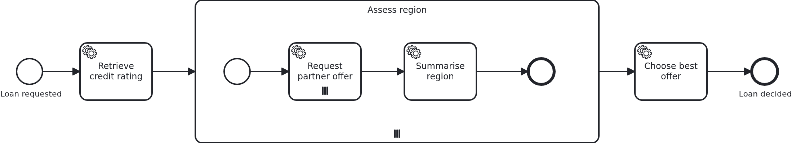

# Multi-instance subprocesses

[](./LICENSE)

Repeating one task is a multi-instance task. Repeating a whole section of a process - several
tasks, a flow, maybe a wait state - is a multi-instance subprocess. This blueprint shows one,
with a second iteration nested inside it, which is where the question "which loop am I in?"
stops being rhetorical.

## What this blueprint shows



The loan approval is assessed once per region, and inside every region every partner is
asked for an offer. Two loops, four offers, two region results, one decision.

The subprocess is what repeats: everything drawn inside it runs again per region, and no
Java says so. The tasks in it are wired like any other, which is the property worth keeping -
the same handler serves whether the section runs once or fifty times.

Three kinds of task appear inside, and they differ in what they need to know:

`requestPartnerOffer` sits in BOTH iterations, so it is handed an `Iteration` record built
by a resolver:

```java
@WorkflowTask
public void requestPartnerOffer(
    final Aggregate loanApproval,
    @MultiInstanceElement(resolverBean = IterationResolver.class) final Iteration iteration) {
```

A resolver is handed every active multi-instance context, keyed by the BPMN id of its element
and ordered outermost first, and returns whatever the method wants. That is the SPI's answer
to nesting: one object saying what the pair means, instead of six parameters.

`summariseRegion` belongs to the outer iteration only, and asks for it by name:

```java
@MultiInstanceElement("SubProcess_AssessRegion") final String regionId,
@MultiInstanceIndex("SubProcess_AssessRegion") final int index,
@MultiInstanceTotal("SubProcess_AssessRegion") final int total
```

**The task is not multi-instance itself and still runs inside an iteration.** That is the
point of a multi-instance subprocess, and it is why every annotation names an element: a
method has to say which of the active iterations it is asking about.

`chooseBestOffer` sits after the subprocess and knows nothing about any iteration. A result
over all regions belongs there, a result over one region's partners belongs at the end of
that region - `summariseRegion` - and neither belongs into a task which sees one element.

What is iterated over comes from the workflow aggregate, one collection per level. Every
iteration writes ROWS rather than attributes: `PartnerOffer` per region and partner,
`RegionResult` per region. Instances run next to each other, each of them saves the whole
aggregate, and two of them writing one attribute means the one committing last wins.

## Delta to the base blueprint

Compared to [`module-single`](https://github.com/vanillabp-blueprints/module-single-springboot):

|            File            |                                        What is different                                         |
|----------------------------|--------------------------------------------------------------------------------------------------|
| `loan_approval.bpmn`       | a multi-instance subprocess, a multi-instance task inside it, and a plain task inside it as well |
| `Aggregate.java`           | a collection per level, and the rows the two loops write                                         |
| `PartnerOffer.java`        | new: one row per inner iteration, carrying the region it belongs to                              |
| `RegionResult.java`        | new: one row per outer iteration                                                                 |
| `IterationResolver.java`   | new: builds one object out of both active iterations                                             |
| `Iteration.java`           | new: what that object is                                                                         |
| `WorkflowTaskHandler.java` | a task in both loops, a task in the outer one, a task after them                                 |
| `Service.java`             | one method per step, none of them knowing about a loop                                           |
| `loan-approval.yaml`       | regions and partners, which is what decides how often each level runs                            |
| `LoanApprovalIT.java`      | asserts the rows of both levels, in no particular order                                          |

Compared to
[`bpmn-multi-instance-task`](https://github.com/vanillabp-blueprints/bpmn-multi-instance-task-springboot),
which repeats a single task: the iteration moves to a subprocess, a second one is nested
inside it, and the resolver appears because a method now sits in two loops at once.

## Running it

Requires a JDK 21. Camunda 7 is embedded, so nothing else has to run:

```bash
mvn install verify
```

Running it on another BPMS is a Maven profile, not one line of Java changes:

```bash
mvn install verify -Pcamunda8
```

Camunda 8 is a remote engine, so a cluster has to run. Start one; its address, and everything
else specific to that engine, lives in its profile file
`application/src/main/resources/application-camunda8.yaml`, with a copy for the module's own
test:

```yaml
vanillabp:
  adapters:
    camunda8:
      # Camunda 8 is a remote engine: point this at your cluster.
      rest-address: http://localhost:8080
```

That file is loaded because the Maven profile `camunda8` sets the Spring profile of the same
name, so the engine is chosen once, on the Maven command line, and the build, the tests and
`spring-boot:run` all follow it.

Start the application:

```bash
mvn -pl application spring-boot:run
```

Nothing about identifiers shows up at startup: the BPMS profiles of this blueprint set
`name-clash-avoidance: use-prefix`, so VanillaBP puts the workflow module ID in front of every
identifier before it reaches the engine and takes it off again on the way back. The BPMN files,
the business code and the rest of the configuration keep the plain names, and no tenant is
involved, which matters on a BPMS licensed per tenant. What the modes are and what each of them
costs is in
[the wiki](https://github.com/vanillabp/adapter-platform-integration/wiki/Workflow-modules#how-name-clashes-are-avoided).

This is the URL that starts a loan approval:

```
http://localhost:8080/api/loan-approval/start?amount=5000
```

The log shows both loops, and which position every call has in them:

```
Loan approval '764f…' started
Credit rating of loan approval '764f…' is 50, asking 2 partner(s) in 2 region(s)
Asking partner 1 of 2 in region 1 of 2 for loan approval '764f…'
Asking partner 2 of 2 in region 1 of 2 for loan approval '764f…'
Asking partner 1 of 2 in region 2 of 2 for loan approval '764f…'
Asking partner 2 of 2 in region 2 of 2 for loan approval '764f…'
Region 'north' of loan approval '764f…' settles on 'northern-bank' at 70 basis points
Region 'south' of loan approval '764f…' settles on 'northern-bank' at 85 basis points
Loan approval '764f…' takes 'northern-bank' in region 'north' at 70 basis points, out of 2 region(s)
```

The result of a run is at

```
http://localhost:8080/api/loan-approval/{loanRequestId}
```

Add a region to `loan-approval/src/main/resources/loan-approval/loan-approval.yaml` and the
subprocess runs three times instead of twice, with every partner asked in each of them. The
model is not touched, which is why the two lists live in configuration.

While the application runs on Camunda 7, Camunda's own web applications are served at

```
http://localhost:8080/camunda
```

Log in with `demo` / `demo`. Cockpit draws the subprocess with the number of instances it
ran, and lets you step into one of them, which is the quickest way to see what an iteration
is from the outside. The user comes from
`application/src/main/resources/application-camunda7.yaml` and exists so that the
blueprint can be operated without setting one up; an application with an identity provider
of its own leaves that section out.

The Camunda 8 profile brings neither the dependency nor those settings into effect. Its
tooling is part of the cluster, and the file naming a Camunda 7 adapter id is simply not
loaded there - a profile file applies to its own engine and to no other. Naming an adapter
id whose adapter is not on the classpath is a configuration error VanillaBP refuses to
start with, and the profiles are what keeps that from happening.

## How it works

|                                            File                                            |                                     Role                                      |
|--------------------------------------------------------------------------------------------|-------------------------------------------------------------------------------|
| `loan-approval/src/main/resources/loan-approval/processes/<adapter-id>/loan_approval.bpmn` | the subprocess, the task nested in it and the plain task inside the iteration |
| `.../loanapproval/IterationResolver.java`                                                  | builds one object out of every active iteration                               |
| `.../loanapproval/WorkflowTaskHandler.java`                                                | one method per task, each asking for the level it belongs to                  |
| `.../loanapproval/Service.java`                                                            | the business code, which knows regions and partners but no loops              |
| `.../loanapproval/model/Aggregate.java`                                                    | a collection per level, and the rows the iterations write                     |
| `.../loanapproval/model/PartnerOffer.java`, `RegionResult.java`                            | a row per inner and per outer iteration                                       |
| `loan-approval/src/test/.../LoanApprovalIT.java`                                           | asserts both levels, in no particular order                                   |

The order of events: `retrieveCreditRating` writes the two collections, the engine creates
one instance of the subprocess per region, each of those creates one instance of the offer
task per partner, `summariseRegion` runs when a region's offers are in, and
`chooseBestOffer` when the last region is done.

A nested iteration is where the BPMS differences would show if the application had to know
them, so it is worth saying that it does not: Camunda 7 reports the iterations from its
execution hierarchy, Camunda 8 has none and its adapter prepares the model while deploying
so the values arrive anyway. The Java above is the same on both.

## Documentation

- [Multi-instance](https://github.com/vanillabp/spi-for-java#multi-instance): the three annotations, and the resolver for nested iterations
- [Workflow aggregates](https://github.com/vanillabp/adapter-platform-integration/wiki/Workflow-aggregates): why the collections are attributes, and what several writers do to a row
- [Wire up a task](https://github.com/vanillabp/spi-for-java#wire-up-a-task): what a `@WorkflowTask` method may be handed
- the wiki of the [BPMS adapter](https://github.com/vanillabp/adapter-platform-integration/wiki/BPMS-adapters) you use: what that engine reports about an iteration

This blueprint is developed in the monorepo
[`blueprints`](https://github.com/vanillabp-blueprints/blueprints). This repository is a
read-only mirror, **issues and pull requests belong there.**

## Noteworthy & Contributors

[VanillaBP](https://www.github.com/vanillabp/spi-for-java) was developed by [Phactum](https://www.phactum.at) with the
intention of giving back to the community as it has benefited the community in the past.


## License

Copyright 2026 Phactum Softwareentwicklung GmbH

Licensed under the Apache License, Version 2.0
